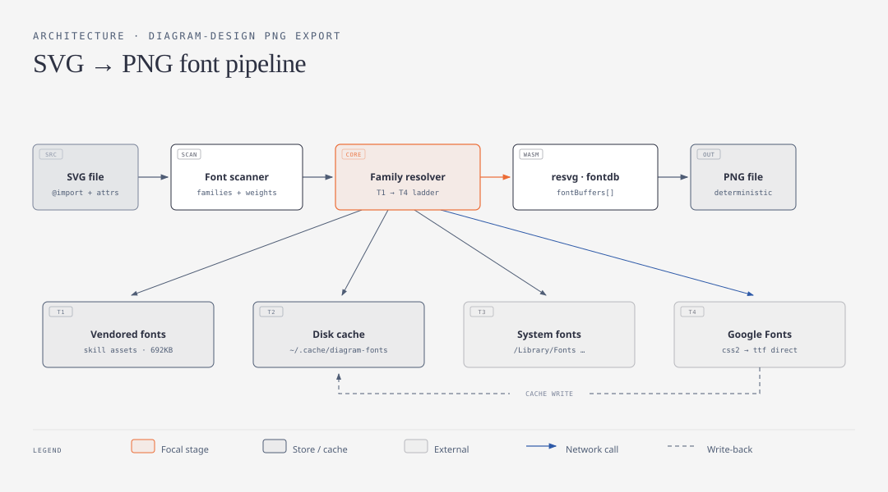
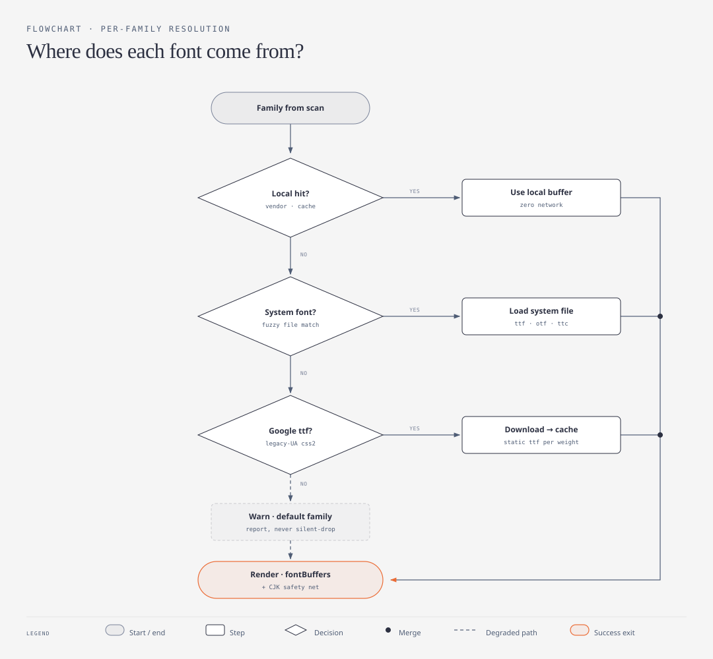

# SVG → PNG 导出：字体解析管线方案

> 状态：方案设计（PoC 已验证）· 2026-06-12
> PoC 位置：`/tmp/svg2png-standalone/`（可直接照搬为 `scripts/`）

为 diagram-design skill 增加 PNG 导出能力。渲染器选型为 vendor 进 skill 的 `@resvg/resvg-wasm`（约 2.4MB，单一产物全平台通用，零安装、离线、像素级确定），唯一的复杂度集中在**字体供给**——本文档即字体解析管线的设计。



整体流程：**Font scanner** 从 SVG 提取字体需求 → **Family resolver** 按 T1→T4 阶梯逐家族解析出字节 buffer → 全量 `fontBuffers[]` 喂给 **resvg/fontdb** 光栅化输出 PNG。

---

## 1. 从 `@import` 远程地址解析字体

SVG 内部不含字体数据，只有两类线索，scanner 都要扫：

1. **`<style>` 里的 `@import`** —— skill 生成的 SVG 固定带一行 Google Fonts css2 URL，
   其 query 即权威的「家族 + 字重」声明（注意 SVG 里 `&` 写作 `&amp;`）：
   ```
   @import url('https://fonts.googleapis.com/css2?family=Geist:wght@400;500;600&family=Instrument+Serif:ital@0;1&...')
   ```
   直接解析 `family=` 参数即可得到 `Geist → [400,500,600]`、`Instrument Serif → [ital 0/1]`。
2. **元素属性兜底** —— 正则扫 `font-family="..."` / `font-weight="..."`，与 ①取并集。
   外部来源的 SVG 可能只有属性没有 `@import`。

拿到家族列表后，**Google Fonts 的 ttf 直链通过 legacy-UA 技巧获取**（已实测）：

```
GET https://fonts.googleapis.com/css2?family=Lora:wght@400;600
    User-Agent: curl/7.0        ← 声明不支持 woff2 的老客户端
→ 返回的 CSS 里是 fonts.gstatic.com/s/lora/v37/....ttf 直链
```

两个实测确认的关键性质：

- **返回的是按字重实例化好的静态 ttf**（请求 400;600 得到两个独立文件，各约 130KB）。
  这天然绕开了可变字体陷阱（见 §4）。
- **URL 自带版本号**（`/lora/v37/`），同一 URL 内容永不变 —— 把解析到的版本化 URL
  连同字节一起落缓存，实时下载就收敛成了「钉死版本的延迟 vendor」，确定性不丢。

非 Google 的 `@import`（自托管 CSS）：fetch CSS → 解析 `@font-face` 的 `src: url(...)`，
按 `format()` 优先挑 ttf/otf 条目；只有 woff2 时进入 §3 的降级路径。

## 2. 让 resvg 支持这些字体

resvg 内部用 fontdb 做字体索引，接口是 `fontBuffers: Uint8Array[]` —— **收内存字节，
不要求文件**。下载响应的 `arrayBuffer()` 直接喂入即可（已实测，全程不落盘也能渲染）。

解析阶梯（架构图中 T1→T4，按确定性与速度排序）：

| 层 | 来源 | 网络 | 确定性 | 备注 |
|---|---|---|---|---|
| T1 | vendor 目录（skill 自带 8 个文件，692KB） | 无 | 像素级 | Geist ×3 · Geist Mono ×3 · Instrument Serif ×2，全 OFL |
| T2 | 磁盘缓存 `~/.cache/diagram-fonts/` | 无 | 像素级 | 键 = 版本化 gstatic URL |
| T3 | 系统字体目录 | 无 | 随机器而变 | Node 自行读文件喂 buffer；`loadSystemFonts:false` 只是 wasm 沙箱进不了 fs，不是能力缺失 |
| T4 | Google Fonts 实时下载 | 一次 | 钉版本后确定 | 下载即写 T2 |

fontdb 侧的配置要点：

- `defaultFontFamily` 必须指向一个**确实存在于 buffers 里**的家族（兜底锚点）。
- 通用族映射：`sansSerifFamily` / `serifFamily` / `monospaceFamily` 指到 vendor 字体，
  让 `font-family` 列表里的 `sans-serif` 等通用名有着落。
- **SVG 含 CJK 时追加一个宽覆盖兜底字体**（系统 CJK 或下载的 Noto），缺字形的文本
  自动落到它。已实测三点：① `font-family="Geist"` 的中文自动落到追加的 Hiragino
  （ttc 集合直接可用）；② 追加兜底字体对纯拉丁文本**像素级零影响**（加/不加 CJK
  buffer 输出逐字节相同），可放心常开；③ **fallback 粒度是整个 text chunk 而非
  单字符**——混排文本（如 `用户服务 API`）会整段切到 CJK 字体（按字符覆盖度选字），
  拉丁部分不保留品牌字体。这与浏览器的逐字符 fallback 行为不同（见 §4）。

T3 的实现约束：不全量加载系统字体目录（macOS 含 Supplemental 数百 MB），用
「家族名归一化 ↔ 文件名模糊匹配」筛出候选喂给 fontdb 精确判定。

## 3. 下载失败 / 格式不满足时的 fallback



fontdb 的失败模式是**静默的**（缺家族→默认字体；库为空→文字直接消失；缺字重→就近
降级），且没有任何 API 报告「哪些字体没找到」。因此原则是：**渲染前由 resolver 自己
判定每个家族的着落并显式报告，绝不依赖渲染结果发现问题。**

| 失败场景 | 处理 |
|---|---|
| T4 网络失败 / 超时 | 落入警告分支：该家族回落 `defaultFontFamily`，stderr 打印 `family X unresolved → fallback to Y`，渲染继续 |
| 来源只有 woff2（fontdb 不收） | 同上警告分支。不引入 woff2 解压依赖（保持零依赖）；Google Fonts 走 legacy-UA 后不存在此问题，只影响自托管字体 |
| 家族命中但缺请求的字重 | scanner 已知请求字重，resolver 对照命中文件清单，缺档时预警「600 将由 400 就近渲染」——把 fontdb 的静默就近变成显式提示 |
| 字符缺字形（如拉丁字体遇中文） | CJK 兜底字体接住（按需加载），渲染不缺字 |
| 混排 label（`用户服务 API`） | resvg(2.6.2) 的 fallback 粒度是**整个 text chunk**：混排段整体切到 CJK 字体，与浏览器逐字符 fallback 不一致（拉丁部分 PNG 里非品牌字体、宽度微差）。纯中文/纯英文 label 不受影响；中文场景这与常见中文 UI 排版一致，可接受。彻底解法是生成期 text→path，列为后续项 |
| 极端：连 defaultFontFamily 都无 buffer | resolver 启动时断言 vendor 目录完整，此分支按损坏安装处理，直接报错退出（避免「文字全部消失」的成品流出） |

关键不变量：**任何输入都能出 PNG**（最差是默认字体 + 警告），且**任何降级都有一行
人类可读的报告**。

## 4. 其他边界 case

| Case | 行为 | 应对 | 状态 |
|---|---|---|---|
| 可变字体（`Font[wght].ttf`） | fontdb 只暴露默认实例，500/600 静默渲染成 400 | 只 vendor / 下载静态字重；T4 的 css2 API 天然返回静态实例 | ✅ 已踩过并修复 |
| woff/woff2 | fontdb 不支持（web 传输格式） | legacy-UA 拿 ttf；浏览器预览与 PNG 导出是两套字体供给 | ✅ 实测 |
| ttc 集合 | 支持，整文件喂入即可 | 系统 CJK（PingFang/Hiragino）可直接做兜底 | ✅ 实测 |
| 本地化家族名 | name 表含本地化名，`font-family="思源黑体"` 可匹配 | 无需特殊处理 | 设计内 |
| 同字重 italic | 独立文件（如 InstrumentSerif-Italic.ttf） | scanner 同时提取 `font-style`，逐档解析 | 设计内 |
| `@import` 在 SVG 中的 `&amp;` 转义 | URL 解析前需先做 XML 反转义 | scanner 内一行 `replace(/&amp;/g,'&')` | 设计内 |
| resvg 不支持的 SVG 特性 | `foreignObject` / 脚本 / CSS 动画不渲染 | skill 生成端本就禁用（SKILL.md 输出规范），外来 SVG 预扫描并警告 | 设计内 |
| 输出尺寸与背景 | SVG 是矢量，1x 导出会糊；根元素透明时 PNG 透明 | 默认 `fitTo: width 2160`（2x）；diagram SVG 自带 paper 底色，无需补底 | ✅ 实测 |
| 许可 | 系统商业字体（PingFang/Arial）不可再分发 | vendor 与缓存仅限 OFL/Apache（Google Fonts 全库满足）；T3 系统字体只在本机即时使用，不落缓存 | 设计内 |

## 5. 落地形态

```
going/diagram-design/             # skill 分发单元（agent 可见）
├── scripts/
│   ├── svg2png.mjs               # CLI：node scripts/svg2png.mjs in.svg out.png [width]
│   ├── resvg.mjs                 # @resvg/resvg-wasm 的 JS 胶水（17KB，vendor）
│   ├── index_bg.wasm             # resvg 渲染器（2.4MB，vendor）
│   └── fonts/                    # 8 个静态字重，~1MB，OFL
└── references/png-export.md      # 写给 agent 的操作指引 + 排错表

docs/diagram-design/              # 本方案 + 设计图（工程记录，不随 skill 分发）
```

运行时要求仅为 Node（Claude Code 环境必有）；同一脚本在 bun / deno 下零修改可跑
（已实测 bun）。无 npm install、无 postinstall、无平台二进制、无 Gatekeeper/签名问题。

实测基线：46 个 asset SVG 全部转换成功（2160px 宽），单张 40ms~1s，零失败。
